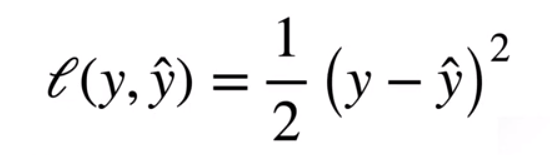
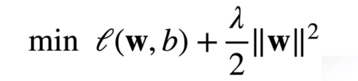

# 跟李沐学AI
## 04 数据操作+数据预处理
### N维数组样例
1d 2d 3d（一张图片） 4d（多张图片） 5d（一个视频批量）
### 创建数组
形状
### 访问元素
一个元素：[1,2]

一行：[1,:] 

一列：[:,1]

子区域：[1:3,1:]

## 05 线性代数
不需要太多线性代数的知识，但是基础知识是需要的

### 标量

简单操作
```
c = a + b
c = a * b
c = sin(a)
```
### 向量
长度

点乘

正交

### 矩阵
乘法（最基础的，必须学会的）

扭曲空间

矩阵乘以从矩阵

A的每一行乘以B的每一列

范数
矩阵范数：最小的满足的上面的公式的值

### 范数
范数：向量的长度

### 特殊矩阵
堆成和反对称

正定矩阵

正交矩阵：所有行都相互正交

### 特征值和特征向量

不被矩阵改变的向量

大小变 方向不变就是特征向量

## 06 矩阵计算

标量导数

导数是切线的斜率

将导数拓展到不可微的函数

亚导数：导数的概念拓展到不可微的函数

梯度：将导数拓展到向量

分子布局
分母布局

## 08 线性回归 + 基础优化算法

如何在美国买房

看中一个房子，参观了解

估计一个价格，出价

房价预测

一个简化模型

假设1：
假设2：

权重和偏差的实际值在后面决定

线性模型可以看作是单层神经网络

真实的神经网络

输入 计算在这里发生 输出 输出到下一层

神经网络

比较真实值和预测值
平方损失



训练数据，越多越好

当数据不够时……

训练损失

最小化损失来学习参数

显示解

将偏差加入到权重中

### 总结
线性回归是对n维输入的加权，外加偏差
使用平方损失来衡量预测值和真实值的差异

## 09 Softmax回归 + 损失函数 + 图片分类

回归与分类

回归估计一个连续值

分类估计离散值

对类别进行一位有效编码

使用均方损失训练

最大值预测 argmax

输出匹配概率（非负，和为1）

Softmax回归是一个多类的分类模型

使用交叉熵损失训练

## 10 多层感知机 + 代码实现

人工智能最早的模型

给定输入x，权重w，偏差b，输出y


## 11 模型选择 + 欠拟合和过拟合

训练误差：模型在训练数据上的误差

泛化误差：模型在新数据上的误差

关心泛化误差

例子：根据模考成绩来预测未来考试分数

在过去的考试中表现很好（训练误差）不代表未来考试一定会好（泛化误差）

验证数据集：一个用来评估模型好坏的数据集

测试验证集：只用一次的数据集

验证数据集不要跟训练数据集有交集

测试数据集只能用来使用一次，不能用来调整你的超参数

K-则交叉验证

在没有足够多的数据时使用（这是常态）

算法：将数据分成K份，每次使用其中一份作为验证数据集，其他作为训练数据集，最后取平均值

常用：K取5 / 10

总结

训练数据集：训练模型参数

验证数据集：选择模型超参数

非大数据集上通常使用k折交叉验证

## 权重衰减（weight decay）

用于解决过拟合问题

subject to（受限于）

使用均方范数



可以使用拉格朗日乘子法证明

超参数：不是通过训练得到的参数

超参数 λ 控制了正则项的重要程度

参数更新法则

计算梯度

时间t更新参数

权重衰退通过L2正则项使得模型参数不会过大，从而控制模型的复杂度

正则项权重是控制模型复杂度的超参数

## 13 丢弃法（dropout）

比权重衰退更好的方法

动机：一个好的模型需要对输入数据的扰动不敏感、鲁棒

使用有噪音的数据等价于Tikhonov正则化

丢弃法 在层之间加入噪音

无偏差的加入噪音

使用

通常将丢弃法作用在隐藏全连接层的输出上

丢弃法将一些输出项随机设置为0来控制模型复杂度

常作用在多层感知机的隐藏层控制输出上

丢弃概率是控制模型复杂度的超参数

## 14 数值稳定性 + 模型初始化和激活函数

神经网络的梯度

矩阵乘法带来两个问题，梯度爆炸和梯度消失

使用Relu激活函数

梯度爆炸

值超出值域（infinity）

对于16位浮点数有位严重

对学习率非常敏感

学习率太大 -> 大参数 -> 更大的梯度（爆炸）

学习率太小 -> 训练无进展

我们需要在训练过程中不断调整学习率

使用sigmoid激活函数

梯度消失

梯度值变成0

梯度消失的原因

当数值过大或者过小都会导致数值问题

常发生在深度模型中，因为其会对n个数累乘


